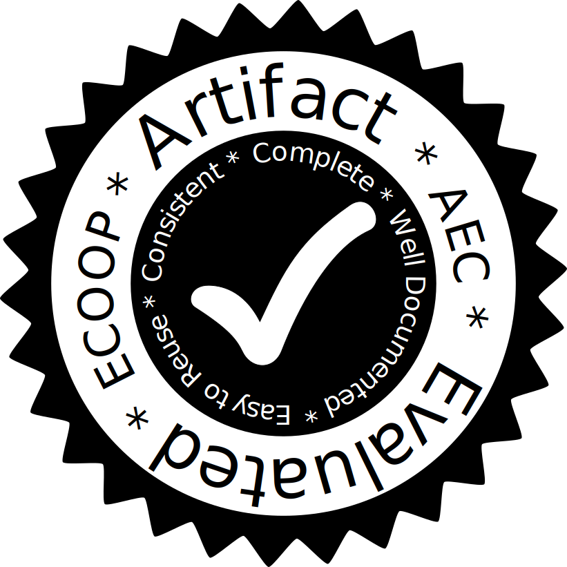
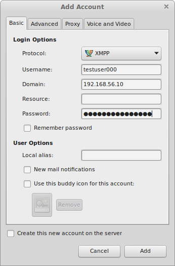
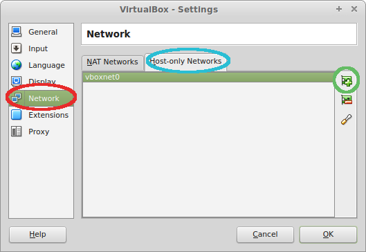

# Staccato: A Bug-Finder for Dynamic Configuration Updates
{:.no_toc}

<p class="authors" markdown="1">
[John Toman](http://homes.cs.washington.edu/~jtoman/),
[Dan Grossman](http://homes.cs.washington.edu/~djg/)
</p>

This is the artifact website for the ECOOP 2016 paper, **Staccato: A Bug-Finder for Dynamic Configuration Updates**.



### Table of Contents
{:.no_toc}
* Contents
{:toc}


## Getting Started

We have provided a VirtualBox virtual machine appliance pre-configured to run Staccato and our paper
experiments. This appliance is known to work with VirtualBox version 4.3. Before importing the
appliance, we strongly recommend you enable [host-only networking](#setup-host-only-networking).
The following sections assume that you have done this
and have chosen to keep the default IP `192.168.56.10` for the VM.

Once you have completed the above steps, open 
VirtualBox and select `File` => `Import Appliance`. When prompted select the `staccato.ova` included in the `vm/` directory of this
expanded artifact archive.
After import, start the virtual machine.

Login with the user "staccato" with the password "staccato". The staccato user has passwordless sudo
access. The project folder for Staccato is ``/home/staccato/staccato``.  All commands in this document assume
that you are working in this directory.

### System Requirements

The artifact is provided in the Open Virtualization Archive format, which should work with any modern
virtualization software. We recommend using VirtualBox version 4.3 or up, as this has been tested extensively
and is known to work. You will need at least 2GB of RAM and 10GB of hard drive space for the virtual machine.
We recommend that you have 8GB of RAM available on the host machine, with at least a 2GHz processor.

### Building Staccato
We have provided a gradle build script to automate the building of Staccato and instrumentation of
our evaluation programs. Step-by-step instructions for running Staccato manually can be found at the end
of this document.

Staccato consists of two components, the offline instrumentation tool and a small runtime library. To build the 
former, run `gradle instrumentJar`. This produces a so-called "fat-jar", named `staccato-instrument.jar` 
that includes all of the dependencies needed to perform instrumentation.

To build the runtime, run `gradle staccatoRuntime`. This will produce `staccato.jar` in the root Staccato directory.
Detailed instructions on running programs using Staccato can be found [here](#running-a-program-instrumented-with-staccato).


### Evaluation Programs

The modified and clean source code for the programs used in our evaluation can be found in
``/home/staccato/evaluation-programs``. The source directories are as follows (relative to ``/home/staccato/evaluation-programs``):

Program | Modified | Clean
--------|----------|------
Openfire | `openfire_src/` | `openfire_orig/`
Subsonic | `subsonic-code/` | `subsonic-orig/`
JForum | `rafaelsteil-jforum2-190d28b/` | `jforum-clean/`

Resources for testing and running each evaluation program can be found in the subdirectories of
``/home/staccato/staccato/evaluation``. Note that due to resource limitations on the VM,
only one evaluation program should be run at a time. Subsonic and JForum both run within the Tomcat server,
and as a part of their deploy process will remove any other webapps running within Tomcat.

#### Running Subsonic
To run the un-instrumented version of Subsonic, run `sudo evaluation/deploy_wrapper subsonic base`. The
Staccato instrumented version can be run by instead running the command
`sudo evaluation/deploy_wrapper subsonic inst`. 
Startup time for the instrumented version will be noticeably higher than the stock version of subsonic
due to the overhead imposed by Phosphor and Staccato's instrumentation. 

When the `deploy_wrapper` command exits, a version of the subsonic webapp will be running on the virtual machine.
On the host machine running the VM, open a web-browser and enter the address [http://192.168.56.10:8080/subsonic/index.view](http://192.168.56.10:8080/subsonic/index.view). You will be presented with a login screen.
The default username is ``admin`` with the password ``password``. You should be able to play music, browse the
catalog, and access the administration pages.

#### Running JForum
To run the un-instrumented version of JForum, run `sudo evaluation/deploy_wrapper jforum base`. The instrumented
version can be run by passing `inst` as the second argument to `deploy_wrapper` in place of `base`. As with
Subsonic, the startup time for the instrumented version will be noticeably higher. 

When the `deploy_wrapper` command exits, JForum will be running on the VM. 
Visit the following address in a web browser running on the
host machine: [http://192.168.56.10:8080/jforum-2.1.8/](http://192.168.56.10:8080/jforum-2.1.8/). The
administrator login for JForum is the username ``Admin`` with the password ``foobar``. You should be able to make
and view posts, and send private messages to other users.

#### Running Openfire
Unlike JForum and Subsonic, Openfire runs as a standalone application. There is no daemonization code. To run the
unistrumented version, execute `evaluation/openfire/deploy_of.sh base`.
The instrumented version can be run with `evaluation/openfire/deploy_of.sh inst`. Both commands start the Openfire application on the current terminal.
The application startup process is complete when the sentence: `Admin Console listening at...` appears on the
terminal.

(**Note**: if the startup fails with the error: `java.rmi.server.ExportException: Port already in use: 60001`, this is due
to a port conflict with a running tomcat sever. Simply run the command given in the [tear down](#tear-down) section and
try again.)

The Openfire admin console can be accessed from
[http://192.168.56.10:9090/login.jsp](http://192.168.56.10:9090/login.jsp) (accessed from the host machine).
The administrator login is `jtoman` with the password `foobar`.

The interesting functionality of Openfire is accessed via a chat client. Install an XMPP
capable chat client (such as [Pidgin](http://pidgin.im/)) on the host machine. The account
credentials are as follows:

* Domain: `192.168.56.10`
* Username: `testuserXXX`
* Password: `testpasswordXXX`

Where `XXX` is any zero-padded number between 0 and 1000. An example account setup for
Pidgin is shown below:



To kill Openfire, simply send a `SIGTERM` with `Ctrl-C`.

### Tear Down

Sometimes killing one of the test scripts detailed in this document
can leave one of the applications running. To kill all
running evaluation programs, run the following command:

`sudo bash evaluation/kill_tomcat.sh; sudo kill -9 $(ps aux | grep startup.jar | grep -v grep | awk '{print $2}') 2> /dev/null > /dev/null`

## Paper Evaluation

There are 5 main claims in the evaluation portion of the paper.

1) That software suffers from DCU bugs and Staccato can find them (RQ 1 and 2)

2) The annotation overhead for finding these bugs is low (RQ 3)

3) The performance overhead of using Staccato is reasonable (RQ 4)

4) Staccato achieves good coverage (section 6.2, "Checking Coverage")

5) The program repair mechanism can be used to effectively introduce support for several previously
immutable options in Openfire and JForum (sections 6.3.1 and 6.3.2)

In the next five sections we show how to run the experiments that support these claims.

In the final section, we show how to reproduce our informal evaluation of Solr.

As a convenience, we have provided a script which will run all of the following steps without
any further intervention. This script can be invoked as follows:

`bash evaluation/run_everything.sh`

**Note**: The full evaluation can take several hours to complete. The performance tests
included in this artifact are responsible for the majority of this time,
and have been reported to take up to four hours. Each of the following sections includes
rough estimates for the amount of time required to reproduce each claim.

### Bug Finding

We have provided a script to run the evaluation program, test program, and havoc mechanism simultaneously and
collect statistics about what options were checked and what bugs were found. In the following we will give the
instructions for running the experiments for Openfire. To run the experiments for JForum or Subsonic, replace
`evaluation/openfire` in the commands below with `evaluation/jforum` or `evaluation/subsonic` respectively.

To start the bug finder for Openfire, run `python evaluation/run_staccato.py evaluation/openfire/test_config.yml`.
At the end of the execution, you should see output like the following:

```
Found new entry 9c2f0e70
Found new entry d35ed2e7
Found new entry e95bd112
Found new entry 196ccedb
Found new entry bfdc10b0
Found new entry 6ddd7ba8
...
```

(If you are using the `run_everything.sh` script this output will *not* appear on your terminal.)

These entries are bugs are recorded in the *bug database* found at `evaluation/openfire/bug_db.yml`. This database
contains the state of the object found to be stale/inconsistent, the stacktrace, and whether there
was a repair operation involved. We have pre-classified these raw bugs reported by Staccato. To see the results
of our classification run the following:
`python evaluation/classify_bugs.py evaluation/openfire/bug_db.yml evaluation/openfire/bug_classification.yml`.

The numbers reported in the paper for Openfire should closely match those reported in the output of this tool.
In some cases the numbers may be higher due to bug-fixes we made post-submission. We have also included sample
bug databases for each of the evaluation programs. The sample bug db for openfire is located at
`evaluation/openfire/sample_bug_db.yml`.

**Note**: JForum will report one repaired stale option not reported in the paper. For simplicity, we
merged the bug finding and update tests into one test execution. This repaired stale option is the one for which
we added update support as mentioned at the end of Section 6.3.2.

**Note**: Some of the bugs in Openfire are the result of very specific thread schedules (specifically those
of the form seen in Figure 8). The virtualized environment supports less concurrency than our original evaluation
environment. In test mode, we have attempted to induce these schedules, however there is no way to guarantee
that these bugs are found in one run. If the numbers reported after one run are too low the test
may be re-run to find more bugs.

**Estimated Time**: Approximately half an hour to run bug finding for all three programs.

#### Sample Bug

We illustrate here some of the bugs described in the paper and the annotations required
to find them.

The Openfire roster bug is found in two files:
`openfire_src/src/java/org/jivesoftware/openfire/roster/RosterManager.java`
and
`openfire_src/src/java/org/jivesoftware/openfire/roster/Roster.java`.

First roster provider is reflectively instantiated in the method `initProvider()`
(line 976 of `RosterManager.java`). The call to our `StaccatoRuntime` is required to work around
the limitation with memoization of Java class files, as mentioned in 5.6. 
The instantiated manager is then cached in the `provider` field of the `RosterManager`.
The `initProvider()` method is also called when the property storing the provider class name,
`provider.roster.className` changes.

Roster objects are instantiated and placed into a cache by the RosterManager
(`getRoster(String)` on line 117 of `RosterManager.java`). Note that the `@StaccatoCheck`
annotation found on the `getRoster(String)` method is not required for finding the roster bug.

On line 134 of Roster constructor (in the file `Roster.java`) the roster provider instantiated
and stored in the `provider` field of the `RosterManager` is cached in the `Roster`'s
`rosterItemProvider` field. This is where the bug occurs: this field is not updated if the
`provider.roster.className` property changes, even if the `Roster` object is still alive in the
cache. The annotations that find this bug are on the methods that access the roster item
provder, e.g., `provideRosterItem` (line 329).


### Performance Evaluation

The test setup used to generate the benchmarks in the paper take a very long time to execute in the provided
virtualized environment -- at least one order of magnitude greater than on the machine used in the paper
experiments.

We have also included shorter versions of tests used for benchmarks in the paper. These tests show similar
results to those found with the longer versions of the tests. To run these "mini-tests" execute:

```
python evaluation/run_all_tests.py
```

Be aware that the mini-tests will still take several hours to execute to completion.

To fully re-create the paper experiments execute:

```
python evaluation/run_all_tests.py --full
```

These commands do not post-process the raw information produced by the tests.
To view the performance evaluation results run:

```
python evaluation/collect_results.py evaluation/data.yml
```

**Note**: The virtualized environment unnaturally amplifies the overhead of
disk intensive operations.
To reduce test times being dominated by disk activity we have disabled several
durability options of Postgres SQL as detailed
[here](http://www.postgresql.org/docs/current/static/non-durability.html).

**Time Estimate**: The mini-tests can take anywhere between 3-6 hours. It is not recommended
to run the full tests at all.

### Annotation Counts

To count the changes made to the codebases and reproduce Table 2 run:

```
python evaluation/count_changes.py
```

These changes are counted from the patches found in `evaluation/$PROJECT/patches` where `$PROJECT` is one of
`openfire`, `subsonic`, or `jforum`. The names of the patches in these directories correspond to the rows
in the produced table.

We have also introduced some miscellaneous changes (e.g. to build scripts or deploy scripts) which are *not*
reflected in these counts. These changes can be found in the file `$PROJECT_changes.patch` in each evaluation
program's sub-directory of `evaluation/`.

**Time Estimate**: Immediate.

### Coverage

To calculate the coverage of Staccato similar to that seen in Table 3 run

```
python evaluation/classify_props.py
```

These numbers are calculated from two sources. The first source is result of our manual classification which
can be found in `evaluation/$PROJECT/$PROJECT_options.yml` where `$PROJECT` is one of `openfire`, `subsonic`,
or `jforum`. The properties recorded in this file give all of the columns except for the `Checked` column.

When Staccato is run with the `run_staccato.py` script all of options
checked and set during the havoc process are recorded. These numbers are found in
`python evaluation/$PROJECT/staccato_logs/props_$TIMESTAMP.yml` where `$PROJECT` is as above and `$TIMESTAMP`
is a timestamp string corresponding to when `staccato` was run. 
The file with the lexicographically largest `$TIMESTAMP` is the most recent test results. The data recorded in
the "prop" file is the source of the `Checked` column.

**Note**: Due to a bug in the classification script used to generate the table in the paper some numbers may not
exactly match. Further the output of this script includes an "other" category. This other category counts
options which cannot be checked due to miscellaneous technical reasons, such as lack of proprietary technology
or unfixable underlying concurrency bugs in the option update code. This category was omitted from the
original table in the paper.

**Time Estimate**: Immediate.

### Openfire Updates

To test the Openfire updates run the script:

```python evaluation/openfire/test_updates.py```

This script executes the test scenario `evaluation/openfire/havoc_test.jmx`.
`havoc_test.jmx` alternates between sending
options updates to Openfire and then exercising the functionality of Openfire affected by these option updates.
The code needed to support these updates can be seen found in `evaluation/openfire/patches/update.patch`.

There are several other areas in the code where we have sketched possible update strategies but do not have
an automatic testing framework in place and therefore do not count these instances as updates.

**Time Estimate**: 5-10 minutes.

### Solr Evaluation

We have also included the informal evaluation of Solr. `evaluation-programs` contains two Solr source trees:
`lucene-solr-broken` and `lucene-solr-fixed`. Both have been annotated to check the analyzer
usage for staleness. The latter source has the fix for [SOLR-3587](https://issues.apache.org/jira/browse/SOLR-3587) applied
whereas the former still exhibits the bug. Both source trees also include the regression test created as part
of the [SOLR-3587](https://issues.apache.org/jira/browse/SOLR-3587) fix which we use to test Staccato's ability
to find the bug.

To run the test on both versions, run `python evaluation/solr/run_detection_test.py`. This will first run
the test on the fixed version which will pass and Staccato will not complain. The second run will fail and the
output will contain a backtrace like the following:

```
   [junit4]   2> 16443 T20 C1 oasc.SolrException.log SEVERE null:edu.washington.cse.instrumentation.runtime.EpochViolationException: Epoch violation detected: {{org.apache.solr.core.CoreContainer@e8d0f89collection1-schema=2}}, bad props: null
   [junit4]   2>         at edu.washington.cse.instrumentation.runtime.TaintHelper.checkObjectTaint(TaintHelper.java:1500)
   [junit4]   2>         at edu.washington.cse.instrumentation.runtime.TaintHelper.checkArgTaint(TaintHelper.java:1440)
   [junit4]   2>         at org.apache.lucene.index.DocumentsWriter.updateDocument$$PHOSPHORTAGGED(DocumentsWriter.java)
   [junit4]   2>         at org.apache.lucene.index.IndexWriter.updateDocument(IndexWriter.java:1322)
   [junit4]   2>         at org.apache.lucene.index.IndexWriter.updateDocument(IndexWriter.java:1294)
   [junit4]   2>         at org.apache.solr.update.DirectUpdateHandler2.addDoc$$PHOSPHORTAGGED(DirectUpdateHandler2.java:201)
   [junit4]   2>         at org.apache.solr.update.processor.RunUpdateProcessor.processAdd(RunUpdateProcessorFactory.java:56)
   [junit4]   2>         at org.apache.solr.update.processor.UpdateRequestProcessor.processAdd(UpdateRequestProcessor.java:51)
   [junit4]   2>         at org.apache.solr.update.processor.DistributedUpdateProcessor.versionAdd$$PHOSPHORTAGGED(DistributedUpdateProcessor.java:403)
   [junit4]   2>         at org.apache.solr.update.processor.DistributedUpdateProcessor.processAdd(DistributedUpdateProcessor.java:288)
   [junit4]   2>         at org.apache.solr.update.processor.LogUpdateProcessor.processAdd(LogUpdateProcessorFactory.java:97)
   [junit4]   2>         at org.apache.solr.handler.loader.XMLLoader.processUpdate(XMLLoader.java:230)
   [junit4]   2>         at org.apache.solr.handler.loader.XMLLoader.load(XMLLoader.java:157)
   [junit4]   2>         at org.apache.solr.handler.UpdateRequestHandler$1.load(UpdateRequestHandler.java:92)
   [junit4]   2>         at org.apache.solr.handler.ContentStreamHandlerBase.handleRequestBody(ContentStreamHandlerBase.java:74)
   [junit4]   2>         at org.apache.solr.handler.RequestHandlerBase.handleRequest(RequestHandlerBase.java:129)
   [junit4]   2>         at org.apache.solr.core.SolrCore.execute(SolrCore.java:1607)
   [junit4]   2>         at org.apache.solr.servlet.SolrDispatchFilter.execute(SolrDispatchFilter.java:454)
   [junit4]   2>         at org.apache.solr.servlet.SolrDispatchFilter.doFilter(SolrDispatchFilter.java:275)
   [junit4]   2>         at org.eclipse.jetty.servlet.ServletHandler$CachedChain.doFilter(ServletHandler.java:1337)
   [junit4]   2>         at org.eclipse.jetty.servlet.ServletHandler.doHandle(ServletHandler.java:484)
   [junit4]   2>         at org.eclipse.jetty.server.session.SessionHandler.doHandle(SessionHandler.java:231)
   [junit4]   2>         at org.eclipse.jetty.server.handler.ScopedHandler.handle(ScopedHandler.java:119)
   ....
```

This backtrace shows the exception Staccato has thrown indicating that the staleness check failed.

**Time Estimate**: 5-10 minutes.

## Extra Resources

### Installing a Desktop Environment

Due to space restrictions the artifact VM does not include a desktop environment. However a very simple
environment can be installed with the following command:

`sudo apt-get install virtualbox-guest-dkms fluxbox xinit firefox pidgin xterm`

(select yes when prompted).

To start the desktop environment, run the following command on the virtual machine console (i.e., not an SSH session):

`startx`

To run programs in the desktop environment, right-click anywhere in the desktop and select the desired application
from the menu. The Pidgin chat client can be found under `Applications > Network > Communications > Pidgin`.
The Firefox browser is not in the menu: to run Firefox open xterm (`Application > Terminal Emulators > xterm`) and then
run the command `firefox` in the terminal window.

### Dependencies

#### Staccato Dependencies

Staccato itself depends on the following software and versions:

* [Gradle](http://gradle.org/): >= 2.2
* [ASM](http://asm.ow2.org/): 5.0.3
* [Javassist](https://github.com/jboss-javassist/javassist/): 3.0
* The forked version of Phosphor included with this artifact

#### Openfire Dependencies

Our Openfire setup uses following software and versions:

* [Postgres SQL](postgresql.org): 9.3
* [Ant](https://ant.apache.org/): Any modern version
* [Tsung](http://tsung.erlang-projects.org/): 1.4.2
* [Apache JMeter](http://jmeter.apache.org/) (havoc test only): 2.12
* [Apache JMeter Seeded Controller Extension](https://github.com/jtoman/jmeter-seeded-controller): 1.0

#### JForum Dependencies

Our JForum setup uses the following software:

* [Postgres SQL](postgresql.org): 9.3
* [Ant](https://ant.apache.org/): Any modern version
* [Apache JMeter](http://jmeter.apache.org/): 2.12
* [Apache JMeter Seeded Controller Extension](https://github.com/jtoman/jmeter-seeded-controller): 1.0
* [Tomcat](https://tomcat.apache.org/): 7.0.52

#### Subsonic Dependencies

Our Subsonic setup uses the following software:

* [Apache JMeter](http://jmeter.apache.org/): 2.12
* [Apache JMeter Seeded Controller Extension](https://github.com/jtoman/jmeter-seeded-controller): 1.0
* [Tomcat](https://tomcat.apache.org/): 7.0.52
* [OpenLDAP Server](http://www.openldap.org): 2.4.31
* [Apache Maven](http://maven.apache.org/): >= 3.0

#### Configuring the Test Software

Sample configurations are included in the evaluation directories for each software. However, before applying
these configurations, we strongly recommend using each program's included setup modes. These will
help setup the database schemas correctly.

To ease recreating our test environments, we recommend reusing our database/ldap credentials when setting up your
software. We recommend the following setup:

* Postgres Host: `localhost` (i.e., the same machine that is running the test software)
* Postgres Port: `5432`
* Openfire database name: `openfire`
* Openfire database user: `openfire`
* Openfire database password: `openfire123`
* JForum database name: `jforum`
* JForum database user: `jforum`
* JForum database password: `jforum`
* Subsonic LDAP Root DN: `cn=admin,dc=nodomain`
* Subsonic LDAP Root password: `foobar`

For populating the databases after running each software's setup process, there are setup
scripts in each program's evaluation folder.

### Lists of Test Files

These files are the tests used for each of the evaluation targets:

* Openfire (relative to `evaluation/openfire`):
  * Warmup script (Performance test only): `tsung-chat-roster-warmup-mini.xml`/`tsung-chat-roster-warmup.xml`
  * Havoc script (Bug finding only): `openfire_havoc.jmx`
  * Main test driver: `tsung-chat-update-mini.xml`/`tsung-chat-update.xml`
  * Update test: `havoc_test.jmx`
* JForum (relative to `evaluation/jforum`):
  * Havoc script (Bug finding only): `forum_havoc.jmx`
  * Test Driver: `forum_test.jmx`
* Subsonic (relative `evaluation/subsonic`):
  * Havoc script (Bug finding only): `ss_havoc.jmx`
  * Test Driver: `ss_test2.jmx`

### Setup Host-only Networking

To setup bridged networking you will first need to create a host-only network within VirtualBox.
You **must** do this step before importing the virtual appliance.
Open `File` (or `VirtualBox` on a mac) `> Preferences > Network` (circled red below) `> Host-only Network` (circled blue below).
If you already have a host-only network named `vboxnet0` then continue to the next paragraph.
Otherwise, click the button on the right with the green plus icon (circled in green below).
This should create a new network with the name `vboxnet0` (as seen in the image).




At this point when you import the appliance and boot the VM you will be able
to SSH from the host machine into the VM with the IP
`192.168.56.10`. If you need to change this IP, follow these instructions:

First, boot the VM and login. Open `/etc/network/interfaces` in your favorite editor with root privileges (e.g. `sudo vim /etc/network/interfaces`).
Starting on line 12, you should see the following:

```
auto eth1
iface eth1 inet static
        address 192.168.56.10
        netmask 255.255.255.0
```

To use a different IP than `192.168.56.10`, Change the IP address `192.168.56.10` on the line `address 192.168.56.10`.
You are free to choose whatever IP works on your setup.
Save and exit the editor. Finally, run the following commands: `sudo ifdown eth1; sudo ifup eth1`.
This should allow you to SSH in using the new IP address you chose. You will not need to repeat these after rebooting the VM.

### Running Staccato without Gradle

The Staccato instrumentation tool is flexible but requires several command-line flags to operate. This
documentation will skip over some options that are used for evaluation purposes or control experimental.
Staccato has two different entry points depending on the type of artifact being instrumented, a WAR or JAR.
However, the general pattern is the same between the two entry points. In either case the JAR or WAR being
instrumented **must** have been instrumented first with the forked version of Phosphor provided with this
artifact.

#### Enum Support

As mentioned in section 5.6, Staccato supports enums but requires the user to opt-in. This choice must be made
consistently throughout the instrumentation and run process. Specifically you must follow these rules:

* The JVM used to run the artifact (see [Running A Program Instrumented With Staccato](#running-a-program-instrumented-with-staccato)) must have been instrumented by phosphor with enum support enabled
* The Phosphor instrumentation pass on the artifact must also have enum support enabled
* Enum support must be enabled when running Staccato

#### Instrumenting with Phosphor

Phosphor should be invoked as follows:

`java -classpath <path-to-phosphor.jar> -multiTaint [extra-flags] [input-jar-or-war] [output-path]`

The `[extra-flags]` can be left blank unless you with to opt-in to enum checking (see below). In this case
add `-withEnumsByValue -forceUnboxAcmpEq`. You will also need to instrument the JVM, see the
[Phosphor documentation](https://github.com/Programming-Systems-Lab/phosphor/) for details on specifying
the input and output paths. Use the same flags for instrumenting the JVM as you would for instrumenting your JAR
or WAR. *The input jar/war will be unchanged*: all Staccato instrumentation must be done on the file specified in
`[output-path]`.

#### Common Options
Staccato should be invoked using the following parameters:

`java -classpath <path-to-staccato-instrument.jar>:<path-to-phosphor.jar> -Dstaccato.method-linear=true -Dstaccato.check-all-lin=true -Dstaccato.runtime-jar=<path-to-staccato.jar> -Dstaccato.wrap-volatile=true -Dstaccato.phosphor-jar=<path-to-phosphor.jar> -Dstaccato.app-classes=<app-pattern> -Dstaccato.jvm=<path-to-instrumented-jvm> [additional flags] [main-class] [args...]`

The value of these parameters should be mostly self-explanatory. However the `staccato.app-classes` requires some
explanation. This pattern is used to identify which classes belong to the application (and not dependent libraries).
This should be specified as a regular expression that matches `JVM internal names` (i.e., all classnames have
`'/'` as a package separator instead of `'.'`). The exact value of the `staccato.app-classes` parameter will
depend primarily on your use case.

The main-class and args will depend on whether you are instrumenting a JAR or WAR file. To add enum support
for your application, add the flag `-Dstaccato.check-enum=true`.
If you have opted into enum support, the instrumented JVM path **must** refer to
a JVM instrumented by Phosphor with enum support enabled. Similarly the artifact **must** have been
instrumented by Phosphor with enum support enabled (see above).

#### Instrumenting a Jar

The main class for Jar instrumentation is `edu.washington.cse.instrumentation.InstrumentJar`. The arguments
are, in order, `[input-jar] [rule-file] [output-jar-name]`. The rule file is explained below.

Any class dependencies needed by the input jar **must** be included on the classpath of the JVM invoking the
Staccato instrumentation. This can be achieved by added another `-classpath` parameter or appending the
necessary JAR paths to the `-classpath` specified above.

Note that if you have library jars that you wish to instrument you will need to invoke `InstrumentJar` multiple
times.

#### Instrumenting a WAR
WARs package dependencies in one single archive. This means application and library instrumentation can be
completed in one step. However setting up the instrumentation process is somewhat more complicated.

First you must unzip the entire WAR file to a directory somewhere on your file system. We will call this
directory the `expanded-war-path`. The path to the original, zipped WAR will be called `original-war-path`.

The main class to use when instrumenting a WAR is `edu.washington.cse.instrumentation.InstrumentWar`.
The arguments are as follows: `[expanded-war-path] [original-war-path] [rule-file] [lib-jar-names]...`

The `rule-file` is explained below. The `[lib-jar-names]` parameter is a (potentially) empty list of jar files
included as dependencies in the WAR that contain classes targeted for instrumentation by your rule file. These
must be the name *only*, and not a path within the archive. For example, to instrument classes in the dependency
library `awesome-db-lib.jar` simply include `awesome-db-lib.jar` after the `rule-file` on the command line.

### The Staccato Rule File Format

The Staccato Rule file format is an alternative method for annotating code. They are primarily used
for instrumenting classes for which the source code is available. The rule file format is line based, one rule
per line.
A limited form of comments is supported: lines starting with `//` (no preceding whitespace) are ignored.
Rules from other files may pulled in with statements of the form `#include other.rules` (note the lack of quotes).
This rule file `other.rules` currently must reside in the same directory as the file containing the include.

Rules primarily *select* methods for instrumentation and describe what should be done with that method. Each
rule either describes how methods should be selected for either checking or propagation.

#### A Note on Selection
{:.no_toc}

In the following two sections, we will discuss how a rule will *select* methods for instrumentation to add
checking or propagation. Selection is generally applied to a single class `C`:
each rule can select zero or more methods for instrumentation in `C`.
A subclass `D` of `C` that overrides methods selected by the rules applied to `C`
will also have those methods instrumented. However, the rules for `C` will not be applied to `D`.

For example, suppose `C` declares a method `foo(int)` and we have a rule that selects all
methods named `foo` in `C`. If we have a class `D` subclasses `C` that overrides `foo(int)`, `D`'s copy of
`foo(int)` will be selected for instrumentation.
However, if `D` also declares a method `foo(int, String)` that does **not**
appear in `C` it will not be selected for instrumentation, despite matching `C`'s name rule.

#### Checking
A check line begins with a `!`. A check line that begins with only one `!` selects methods for checking the
consistency condition, whereas `!!` indicates the staleness condition. A check rule takes the following form:

```
!com.example.ClassName:methodName
```

This will select all methods named `methodName` in `com.example.ClassName`.

#### Propagation

There several ways to selected methods for propagation. By default the propagation rules specify
propagation to the returned object. However, propagation to the receiver may be selected by prefixing
a rule with `^`. The propagation rules are as follows:

* `com.example.ClassName` : Select all methods in `com.example.ClassName` that also return a `com.example.ClassName`
* `<com.example.ClassName,com.example.OtherClass>`: Select all methods in `com.example.ClassName` that return a `com.example.OtherClass`
* `com.example.ClassName:methodName(<methodDescriptor>)` : Select precisely the method named `methodName` in `com.example.ClassName` with the JVM descriptor `<methodDescriptor>`
* `com.example.ClassName:ClassName(<methodDescriptor>)` : Select precisely the *constructor* of `com.example.ClassName` with the descriptor `<methodDescriptor>`. Note that the selected constructor will always propagate to the receiver
* `com.example.ClassName:methodName` : Select all methods named `methodName` in `com.example.ClassName`. All methods
selected with this rule must have the same return type
* `com.example.ClassName:ClassName` : Select all constructors of `com.example.ClassName`. Note that the selected
constructor will always propagate to the receiver.

In addition there is a special short hand for handling so called "java
beans". A rule of the form: ```@com.example:set*``` Selects all methods
prefixed with `set` in all classes that reside in the `com.example`
package (this rule does not apply to sub-packages). The methods
selected using this rule are instrumented to perform propagation to
the receiver object. This rule also selects for receiver-propagation
all constructors of classes appearing in the package
`com.example`. Note that the string `set` is not required and may
substituted with any other string.

Finally, Staccato allows for fine-grained control over what classes can track configuration information.
Usually this information is inferred from the Propagation rules but if this is not sufficient the following rules
may be used:

* `-com.class.NoTrack`: explicitly disables configuration tracking for `com.class.NoTrack`
* `+com.class.DefinitelyTrack`: explicitly enables configuration tracking for `com.class.DefinitelyTrack`

### Running a Program Instrumented with Staccato

To take advantage of Staccato instrumentation the JVM in which the application is run must be launched
with special flags. You must add the arguments `-Xbootclasspath/p:<path-to-staccato-runtime.jar>:<path-to-phosphor.jar> -javaagent:<path-to-phosphor.jar>` somewhere to your command line.

Also, the JVM used to run the application **must** have been pre-instrumented with Phosphor. Remember that if your
application was instrumented to check enums, you must use a JVM instrumented by Phosphor with enum support.

## Acknowledgments

The CSS for this site was written by
[James Bornholt](https://homes.cs.washington.edu/~bornholt/) for the
[Synapse artifact site](http://synapse.uwplse.org/popl16-aec/) and is used with permission.

The Subsonic music server includes three permissively licensed albums:

* "[The Psychedlic And](http://freemusicarchive.org/music/Six_Umbrellas/The_Psychadelic_And/)" by Six Umbrellas. Licensed under the [CC by-sa 4.0](http://creativecommons.org/licenses/by-sa/4.0/)
* "[Elektra](http://freemusicarchive.org/music/SPCZ/Elektra/)" by RPCZ. Licensed under the [CC by-nc-nd 4.0](http://creativecommons.org/licenses/by-nc-nd/4.0/)
* "[Foundation](http://freemusicarchive.org/music/SPCZ/Foundation/)" by RPCZ. Licensed under the [CC by-nc-nd 4.0](http://creativecommons.org/licenses/by-nc-nd/4.0/)
